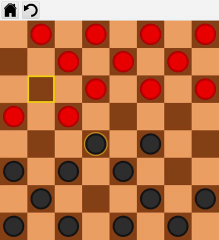

# Multiplayer Checkers

## Short Summary

This is a checkers game created using JavaFX, with multiplayer implemented through the Netty framework.

## In Detail

All animations and most assets were created directly with JavaFX and basic shapes.

Here's an example of the animations:

When it's a player's turn the white halo blinking indicates that you can move that piece.

### Animations shown: 

When selecting a piece it turns yellow to indicate selection and shows the tiles you can move to: 

When selecting a tile and the piece moves to the position and in turn the AI makes its move.

When eliminating a piece: 

When reaching the end a piece is promoted to king: 

And as expected it can move to any of the four tiles: 

### Options

The game allows you to play locally with two players or versus the AI or online if the server is running.

### Explanation for online

It's implemented using Netty and a network protocol I created for communication between clients. When connected, if you try to find a match and the queue is empty, the player is added to the queue,
otherwise the player on top of the queue is dequeued and matched against that player. 